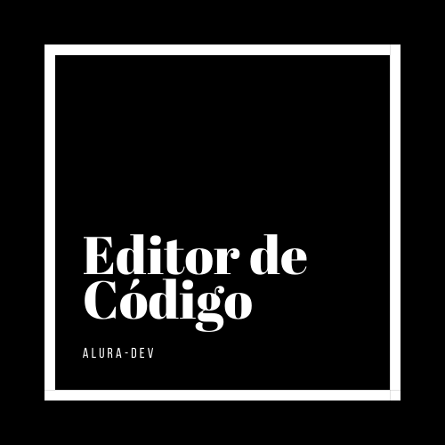

  <h3 align="center">Alura-DEV Code Editor</h3>

  

  
Editor de Código desenvolvido durante Challenge de Front-End da Alura

     
    <a href="https://github.com/priscilasanches/alurachallenge_frontend"><strong>Explore o projeto »</strong></a>
     
     
    <a href="https://alurachallenge-frontend.vercel.app/">Visualizar o projeto</a>
    ·
    <a href="https://github.com/priscilasanches/alurachallenge_frontend/issues">Reportar Bug</a>

## Sobre o projeto

Este projeto foi desenvolvido com o fim de aprendizagem, buscando fixar conhecimentos recém-adquiridos em HTML, CSS e JavaScript, não sendo utilizado, até este momento, nenhum framework para seu desenvolvimento.
 A ideia do projeto, bem como seu design, foram fornecidos pela Alura.
 
 
### Funcionalidades

### Utilizando o editor

### Funcionalidades em desenvolvimento
A funcionalidade do campo de busca e dos botões de comentários, na página Comunidade, encontram-se em desenvolvimento.

### Próximos objetivos

